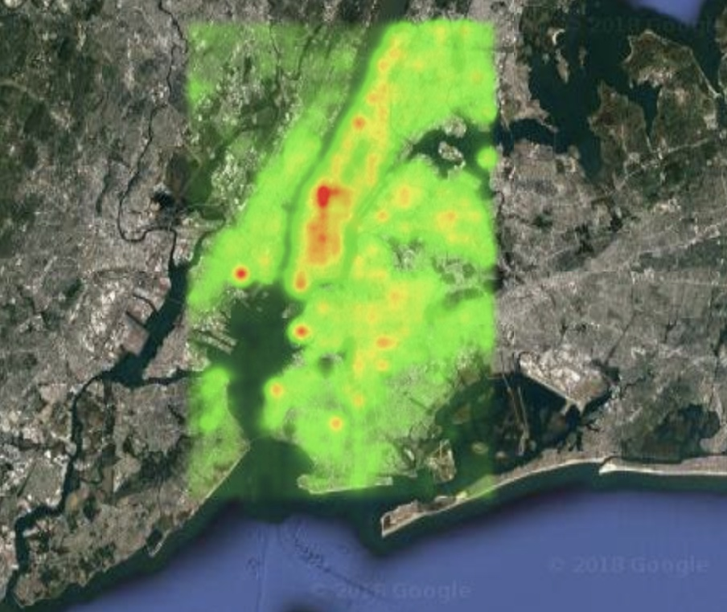

# NYC_Gay_Heatmap
Data set came from a script I wrote that spoofed the GPS in an android emulator
while taking screen shots of profiles in gay dating site Grindr, which shows distance to nearby users.

Code also included for the data clean up for producing a heatmap of gay population density in NYC

OCR was done in batch using Google Cloud OCR. The output is in NYC_GPS_OCR_data

The images and translations are all named by their GPS coordinate.

